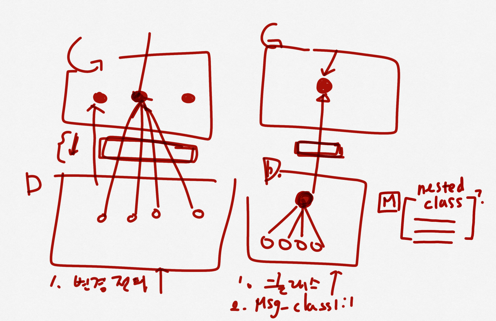

# 백엔드 코드 컨벤션

카테고리를 나누어 생각해 보았습니다. 모든 것을 바로 지킬 수는 없겠지만, 미리 많은 것을 상의해보고 규칙을 정해두면 일관성있는 코드를 작성할 수 있으리라 생각했습니다.

## 1. 네이밍 및 스타일 가이드

* 기본적으로 Google Code Style Guide를 따른다.
* 검증 메서드는 긍정문을 사용한다.
* `getter`가 아닌 메서드에서 `get-`을 사용하지 않는다.
* `-dto`라는 네이밍은 너무 포괄적이므로, 아래와 같이 목적을 정확하게 하자.
  * request, response, clientRequest, clientResponse

## 2. 코드 및 패키지 구조

* 패키지 구조는 도메인 기준으로 한다.
  * 도메인 기준 → 집중하기 편하다, 관심사가 확실하다
  * 레이어 기준 → 접근제어자를 타이트하게 잡을 수 있다. Layered Architecture 패키지이므로 어떤 레이어인지 확실하게 구분할 수 있다.
* 클래스와 선언부 필드 사이는 개행한다.
* `@Valid`를 통한 입력값 검증을 진행한다.
* Enum의 값을 정의할 때, 후행 쉼표를 사용한다.
* Lombok 라이브러리를 사용하되, 그 범위를 제한한다.
* `@Getter`, `@NoArgsConstructor`, `@RequiredArgsConstructor`
* 어노테이션이 여럿 있는 경우, 중요한 것을 가장 상단에 배치한다.
  * Lombok의 어노테이션을 가장 아래에 배치한다.

## 3. 변수 및 메서드 관리

* 메서드의 순서는 `public`을 위에 두되, `private`의 경우 사용하는 메서드 아래에 둔다.
* 필드 변수는 `static final` → `final` → `instance variable` 순서로 정의한다.
* 웬만한 상황에서의 static factory method는 지양한다.
* 메서드 파라미터에는 `final`을 사용하지 않는다.

## 4. 엔티티

* `@Table`과 `@Column` 으로 테이블명, 컬럼명을 명시한다.
 * 예약어인 경우 복수형 또는 동의어를 찾아 작성한다 (예: `order` → `orders`)
* `@Column` 어노테이션의 `nullable` 여부를 명시한다.
* `@Embeddable` 내부에는 `@Embedded`을 사용하지 않는다.

## 5. 테스트

* 테스트 메서드명은 한글로 작성한다. `@DisplayName`는 사용하지 않는다.
* 테스트 메서드는 static import하여 사용한다.
* 테스트 데이터는 메서드 내부에서 설정한다.
  * O: Given절이 길어지지 않음
  * X: Entity 검증을 거치지 않음, 문맥이 드러남
* 테스트 메서드에 given, when, then을 주석으로 표기한다.
  * 두가지 이상이 될 경우 컴마(,)로 연결한다.

## 6. 로깅

* 로그 레벨은 아래와 같이 관리한다. 추가로 필요하다면 자유롭게 로깅한다.
  * info: 외부 API 응답 / 요청은 남긴다.
  * < 이 아래는 슬랙 봇 메시지로 알림 받아야 함 >
  * warn: 내일 아침에 데일리에서 확인해도 무방한 사항
  * error: 자다가도 일어나서 확인해야 하는 사항 → 외부 API 타임아웃, DB 저장 실패 등

## 7. 서비스 & 컨트롤러 구조 및 관리

* `@RestController`에서 `@RequestMapping`을 최상단에 사용하지 않는다.
  * 사용하는 경우, URL 기반 검색이 어렵지만 코드가 단순해진다.
  * 사용하지 않는 경우, 코드 중복이 늘어나지만 각각의 메서드를 따로 관리할 수 있다.
* `@Transactional` 어노테이션을 클래스 최상단에 작성하지 않는다.

## 8. 오류 및 예외 처리

* 에러 메시지를 Enum으로 관리한다.
* 커스텀 예외를 사용한다.
  * 커스텀 예외를 사용한다면 각각 추상화된 카테고리를 통해 Advice에서 각각 잡아야 한다.
  * 모든 Custom의 superclass로 잡으면 Advice에서 상태 코드를 알지 못함 → Service 레이어에서 Web 관련 내용을 알게 된다.
  * Global 의존은 피해야하지만, Exception에 대해서는 어쩔 수 없이 글로벌 패키지를 받아와야 한다.
  * 왼쪽의 경우처럼 모든 곳에서 쓰는 것을 방지하자. 각각의 메시지 클래스를 만드는 게 좋을듯? → 변경 전파를 한 곳에서만 책임지도록 하자.

