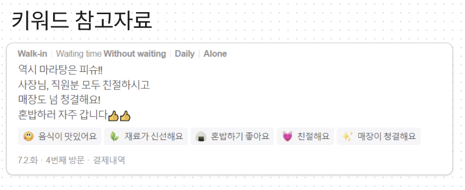

# 🗣️ 7월 3일 회의

**re-view.md** 서비스 기획을 구체화했습니다.

---

### 📌 핵심 기능

- 타겟 : 개발자
- 목표 : 프로젝트 리뷰
- 서비스 주제 : 동료 개발자의 리뷰를 통해 나를 표현할 수 있는 서비스

---

[동료품평회 피그마](https://www.figma.com/design/Btwqmj9PQY2wn1E7c5PzGL/%EB%8F%99%EB%A3%8C%ED%92%88%ED%8F%89%ED%9A%8C?node-id=0-1&t=Vzad3lsMphXSHIJj-0)

- 결정된 아이디어, 의논 중인 아이디어, 앞으로 반드시 진행할 아이디어 3개의 섹션으로 나누어 회의를 진행했습니다.

**결정된 아이디어**에서 조금 애매한 부분

- [리뷰어가 키워드 설정 가능] 의견
  - 직접 문장을 적지 않고 체크 박스 형태를 통해 의견 전달
  - 리뷰를 해달라고 부탁하는 입장인데 체크박스 형태로만 있다면 과연 할까?
  - 리뷰만으로 키워드 추출은 알아서?
  - 키워드 추출을 ai에게 맡기면 잘 해낼 것 인가?
  - 키워드 추출을 해야 하는 가? 아니면 상대방의 리뷰만을 보여주는 것만으로도 충분한가?
  - 나를 대표하는 3문장. 즉 줄글 보다는 형용사로 이루어진 키워드를 통한게 더 표현이 직관적이다. 개성이 다 다르기 때문에 이걸 키워드로 표현하는 것이 더 좋은 것 같다.

- **[피드백 카테고리] 의견** ⇒ 개발, 소프트 스킬 카테고리를 세분화할 수 있을 것 같다.

  - 개발
  - 소프트 스킬
  - 하고 싶은 이야기
    - 카테고리에 없는 내용을 적고 싶다면?
      - 개발 내용에 해당하지만 개발 카테고리에 없는 내용이라면? 기타를 만들어야 하는가?
  - 키워드별 리뷰 분리
    - 예를 들어 “활발함”이면 “활발함”에 해당하는 리뷰를 볼 수 있게끔.
  - 리뷰 상단 고정
    - 노출을 희망하는 리뷰를 상단에 고정
    - 개수 제한(2-3개? 정도가 좋지만 아직 미정)
  - 리뷰 즐겨찾기
    - 리뷰 보관함
      - 나한테만 보인다는 부분에서 리뷰 상단 고정과 차이 => 북마크
  - 레포를 기준으로 어떤 역할을 담당했는지 알 수 있으면 좋을 것 같다.

- **리뷰를 통한 유저 표현(배너 제공)**

  - 키워드 추출

    - 키워드를 어떻게 갖고 올 것인지
    - 모든 리뷰를 추출하고 통계를 내서 보여줘야 한다. 상위 3개 정도.

  - 키워드로 보여줄 것인지 멘트로 할 것 인지.
  - 두 기능 모두 제공하고 사용자가 선택하게끔.
  - 나를 정의하지 못하는 개발자에게 도움이 되어야 한다. ⇒ 내가 적고 싶은 말을 적어두고 그 밑에 팀원들의 리뷰가 적히면 좋지 않을까.
  - 깃허브 리드미 배너 미리보기
    - 애니메이션 고려(svg)
    - 라이브러리 찾기

- **~~유저 마이 페이지~~ 통계 페이지**

  - 키워드 데이터 통계
    - home ⇒ 내가 받은 리뷰 모두 보이게
    - 마이 페이지 ⇒ 통계 페이지
  - 참여한 프로젝트 목록
  - 방문자 기록(투데이?)
  - 어떤 데이터를 통계 페이지에 넣을지 정하는 것이 좋다.
  - 예를 들어, “친절한”, “창의성” 이 있다면 여러 가지 키워드 중에서 “창의성” 몇 개가 있는지 확인

- **키워드별 리뷰 보기**
  - 사용자 보기용
- **키워드 데이터 통계**
  - 상위 3개에 키워드를 확인하기 위함.

---

### ⭐️ 키워드 토론 START ⭐️

키워드 이점

- 키워드가 있다면 한 눈에 파악할 수 있다는 이점이 있다.
- 육각형 혹은 그래프로 키워드를 한 눈에 알아 볼 수 있게 보여준 후 Show Details 탭을 따로 만들어서 상세 리뷰를 보여주기

키워드 문제점

- 키워드가 리뷰어에 생각을 제한한다.
- 리뷰가 키워드에 종속된다는 것이 문제점이다.
- 키워드로 표현할 수 없는 리뷰가 있을 것이다.

키워드 해결점 제안

- ~~받은 리뷰를 보고 내가 키워드를 추출하자.~~
- 리뷰를 먼저 쓰고 키워드를 나중에 선택하자. 단, 적절한 키워드가 없다면 리뷰가 키워드와 관련이 없을 수도 있다.
- PR용과 그 사람을 파악하기 위한 용을 분리하자.
  - PR용 - 받은 리뷰를 통해서 본인의 한줄 소개를 작성
  - 분석용 - 키워드 통계
- 나는 \_\_\_\_ 개발자입니다. 밑에 키워드 3개 보여주기.
  - 나는 \_\_\_\_ 개발자입니다. ⇒ 본인이 적기!
    - 이것에 근거가 되는 리뷰를 볼 수 있게끔?
  - 상위 키워드 3개 ⇒ 통계를 바탕(논의 필요)
- 배너
  - 한줄 소개
  - 키워드(통계) - 옵셔널
  - 리뷰(선택) - 옵셔널

사용자 시나리오

- 서비스 페이지에 들어왔을 때 페이지 첫 화면
- 권한이 있는 사람과 없는 사람 모두 같은 링크로.
- < 리뷰 받는 유저 >
  - 로그인 후 ⇒ 첫 화면 즉, 메인 페이지 ⇒ 주인과 외부 사용자가 같은 화면을 보여준다.
    - 자기소개(한줄)
    - 깃헙 프로필 사진, 이름/아이디
    - 고정된 리뷰
    - 키워드 통계(상위 n개) ⇒ 육각형 스탯은 너무 딱딱하다. 카와이한 UI로. ⇒ 애니메이션까지. ⇒ 시각적으로 개발자 취향에 맞게.
    - ~~최근 받은 리뷰~~ (제거 사유 : 메인 페이지 밑에 전체 리뷰를 보여주기로)
    - ~~대표하는 프로젝트~~ (제거 사유 : 전체 리뷰 보는 페이지에도 같은 내용이 있기 때문)
    - 전체 리뷰
      - 개발 / 소프트 스킬 카테고리 ⇒ 필터/탭 or 드롭다운
      - 검색(레포, 유저, 키워드, 날짜, 내용)

repo 리뷰 / 자유 리뷰

- repo 리뷰와 자유 리뷰는 신빙성에 차이가 있다.
- repo 리뷰만 남겨두고 자유 리뷰는 추후로 미뤄두자.

프로젝트 등록

- API를 이용하자
