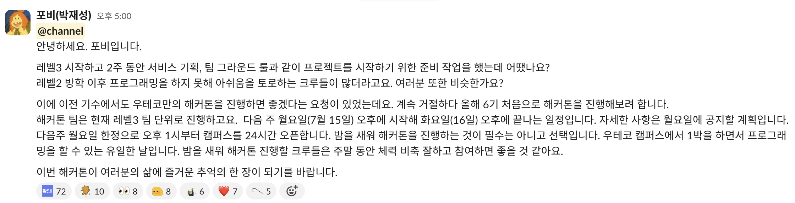
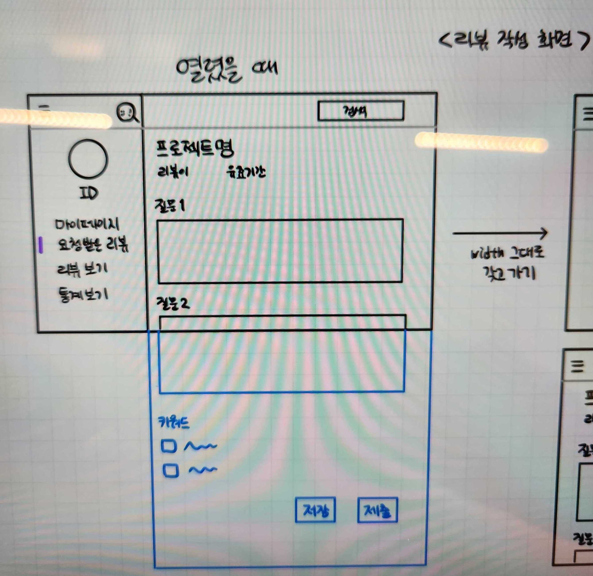

# 해커톤

우아한테크코스 역사상 첫 해커톤

각 프로젝트 조가 정한 주제를 기준으로 핵심 기능을 구현한 뒤, 다음 날 오후 2시에 시연을 진행한다.

## 핵심기능

1. 해커톤에서 구현할 기능 정하기

   - FE - 리뷰 작성, 제출, 상세 보기
   - BE - API 문서

2. 해커톤의 목표 정하기 (e.g. 다른거 다 모르겠고 그냥 구현 / 그래도 최소한의 테스트 코드는 짜며 구현)

3. 역할 분담, 소요 시간, 스케줄 정하기

   - e.g. API 문서 작성은 아루와 커비가 ERD는 테드 그 동안 깃허브 Oauth 는 산초 등등

4. 스케줄 중간 중간 점검

### 프론트엔드

웹팩 설정 수정사항

- http-server를 없애고 webpack-dev-server를 사용했다.
  - 개발 중에 코드 변경 사항을 실시간을 반영할 수 있게 해줘서 별도의 미리보기 서버를 운영할 필요가 없다. 즉, preview가 필요없다.
  - `http-server` 대신 `webpack-dev-server`를 사용하는 경우, `preview`가 필요 없는 이유는 `webpack-dev-server`가 제공하는 실시간 업데이트 기능과 핫 모듈 리플레이스먼트(Hot Module Replacement, HMR) 덕분이다.

페이지 마크업 담당(페어로 진행)

- 리뷰 작성 화면(사이드바 열렸을 때 기준)
  - 에프이, 쑤쑤
- 리뷰 상세 보기 화면
  - 바다, 올리

### 백엔드

API 문서(노선 공유)

- 리뷰 쓰기
- 리뷰 상세 보기
- 리뷰 쓰기 위해 받아오는 정보
- 키워드 목록 받아오기

### 공통

프론트엔드와 백엔드 각자 맡은 업무를 수행하고, 다음 날 API 통신을 시도해보기로 결정했다.
